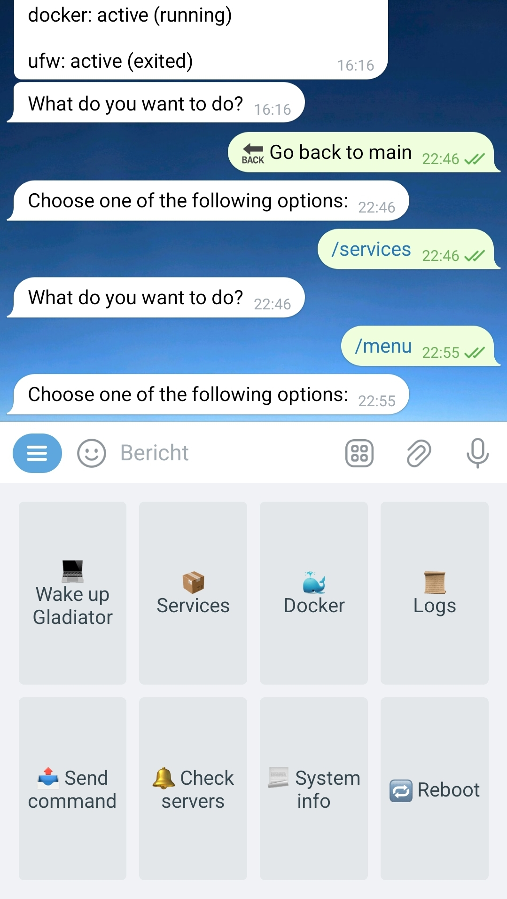

# Linux server Telegram bot
This is a bot lets you control you Linux server using a Telegram bot. I've tested it on Ubuntu 22.04, 22.10 and Raspberry Pi 5, but I'm pretty sure that it will work on any Linux server. The main use case is monitoring critical processes like Docker containers and services you have running on a server. But you can also manually perform some actions on your Linux server. The bot has a menu to choose what you want to do.

It consists of two services: a monitoring service which will check several parameters, and a bot which allows you to control your Linux server.

It's ideal if you have a single server running, with certain custom services and/or containerized applications and you want to be able you control them on the fly, and having them monitored in an easy way.

## Features

### Monitoring (runs every 5 minutes)
- Check CPU usage
- Check memory usage
- Check disk usage
- Check Docker containers
- Check services
- Ping some servers or websites
- Tries to restart services and docker containers if they fail
- Sends notifications when something happens

### Bot
- Wake up a Wake on LAN device if in the same network (requires a device supporting Wake on LAN, and etherwake)
- Manually check services
- Start, stop or restart services
- Manually check Docker containers
- Start, stop or restart Docker containers
- Check certain logs
- Send custom commands to server
- Check system information
- Reboot the server

<center></center>

## Table of Contents
1. [Linux server Telegram bot](#linux-server-telegram-bot)
2. [Features](#features)
   - [Monitoring (runs every 5 minutes)](#monitoring-runs-every-5-minutes)
   - [Bot](#bot)
3. [Setup](#setup)
   - [Prerequisites](#prerequisites)
   - [Installation](#installation)
     - [Clone the repository](#clone-the-repository)
     - [Create virtual environment for monitoring](#create-virtual-environment-for-monitoring)
     - [Create virtual environment for bot](#create-virtual-environment-for-bot)
     - [Setup environment variables](#setup-environment-variables)
     - [Setting up the Systemd service](#setting-up-the-systemd-service)
     - [Modify text files](#modify-text-files)
     - [Start services](#start-services)
4. [Usage](#usage)
   - [Monitoring](#monitoring)
   - [Bot](#bot-1)
5. [Contributing](#contributing)
6. [License](#license)


## Setup

### Prerequisites
- A linux server (RapsberryPi, Ubuntu, etc)
- A Telegram bot token. You can get one by creating a bot through the [BotFather](https://core.telegram.org/bots#botfather).
- Python3 installed on the server.
- If you want to make use of the Wake On Lan feature, you need to install etherwake.

*Important:* The bot needs admin privileges to use certain features.

### Installation

1. **Clone the repository**
    ```bash
    git clone https://github.com/MadeByAdem/Linux-server-Telegram-bot
    cd Linux-server-Telegram-bot
    ```

2. **Create virtual environment for monitoring**
    ```bash
    cd linux_bot
    python -m venv venv
    source venv/bin/activate  # On Windows, use `venv\Scripts\activate`
    ```

    Install the required packages for the nest_bot:

    ```bash
    pip install -r requirements.txt
    ```

    Deactivate the virtual environment:

    ```bash
    deactivate
    ```

3. **Create virtual environment for bot**
    ```bash
    cd linux_monitoring
    python -m venv venv
    source venv/bin/activate  # On Windows, use `venv\Scripts\activate`
    ```

    Install the required packages for the nest_bot:

    ```bash
    pip install -r requirements.txt
    ```

    Deactivate the virtual environment:

    ```bash
    deactivate
    ```

4. **Setup environment variables**
    Copy the `.env.example` file to `.env` and change the variables with your variables. 
    ```bash
    cp .env.example .env
    ```   
    You can obtain your Telegram chatID by chatting with the Telegram bot @RawDataBot on https://t.me/raw_data_bot

    You can obtain your Telegram bot token by creating a bot on https://t.me/BotFather

5. **Setting up the Systemd service**
    Modify the service files:

    Update the `linux_bot.service` file with your actual paths:
    ```ini
    [Unit]
    Description=Linux Bot
    After=network.target

    [Service]
    ExecStart=/your/path/to/linux_bot/venv/bin/python /your/path/to/linux_bot/linux_bot.py
    WorkingDirectory=/your/path/to/linux_bot
    User=root
    Restart=always

    [Install]
    WantedBy=multi-user.target
    ```

    Update the `linux_monitoring.service` file with your actual paths:
    ```ini
    [Unit]
    Description=Linux Monitoring
    After=network.target

    [Service]
    ExecStart=/your/path/to/linux_monitoring/venv/bin/python /your/path/to/linux_monitoring/monitoring.py
    WorkingDirectory=/your/path/to/linux_monitoring
    User=root
    Restart=always

    [Install]
    WantedBy=multi-user.target
    ```

    Copy the service files to the `/etc/systemd/system/` folder:

    ```bash
    cp linux_bot.service /etc/systemd/system/
    cp linux_monitoring.service /etc/systemd/system/
    ```

6. **Modify text files**
    The linux_bot directory had three text files:
    - `bot_logfiles.txt` \
        Copy and past all the paths to the logs on separate lines if you want to have access to through the bot.
    - `bot_servers.txt`
        Set all the servers you want to ping on separate lines if you want to be able to ping them through the bot. (Format: name=ipaddress:port) You can also put websites here. Use port 80.
    - `bot_services.txt`
        List all the services you want to check by their names on separate lines if you want to be able to check them through the bot.

    The linux_monitoring directory had three text files:
    - `monitoring_containers.txt`
        List all the containers you want to check by their names on separate lines if you want the bot to monitor them.
    - `monitoring_servers.txt`
        Set all the servers you want to ping on separate lines if you want the bot to monitor them. You can also put websites here. Use port 80.
    - `monitoring_services.txt`
        List all the services you want to check by their names on separate lines if you want the bot to monitor them.

        **Important:** The bot needs admin privileges to use certain features.

        **Tip:** Add the linux_bot to the `monitoring_services.txt` so that the bot can monitor it as well.

7. **Start services**
    ```bash
    sudo systemctl daemon-reload
    sudo systemctl enable linux_monitoring.service
    sudo systemctl enable linux_bot.service
    sudo systemctl start linux_bot.service
    sudo systemctl start linux_monitoring.service
    ```

## Usage

### Monitoring
The monitoring service will check all the listed services, servers, containers and certain system info every 5 minutes. When a service or container is down, it will try to restart it. It will inform you when this happens and the restart was successfull.

It will inform you if the server you listed is online (ping) or not. If not, it will try again within 2 minutes. If the server still did not respond it will tell you so.

It will notify you if your CPU, memory usage or disk usage is high.

### Bot
Send /menu and you will get a menu with all the options:
- menu - Show the menu
- wakewol - Wake up device
- services - Get services options
- docker - Get docker options
- logs - Get logs
- ping - Check servers
- command - Run a command
- sysinfo - Get system information
- start - Start the bot
- reboot - Reboot the server

## Contributing
Feel free to submit issues or pull requests if you have suggestions for improvements or new features. Please follow the existing coding style.

## License
This project is licensed under the Custom License. See the [LICENSE](LICENSE) file for more details.